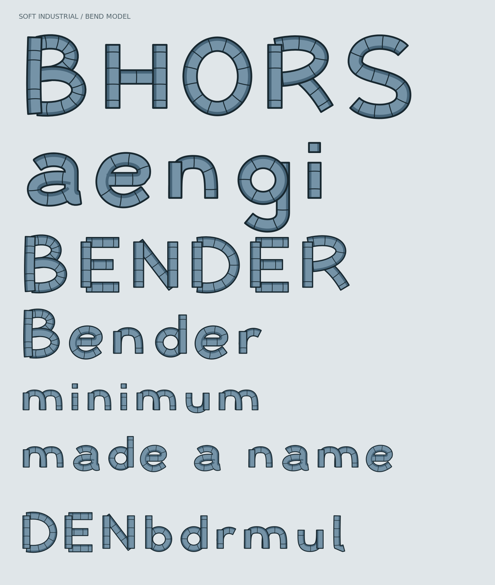

# b

A soft-industrial alphabet made of segmented steel ribbons, generated in [Bend](https://bend-lang.com/).



19 uppercase and lowercase glyphs. Bend validates the geometry before generating SVG; an independent checker verifies the output. Seam laws are proved; the full continuous topology proof remains open.

```sh
python3 alphabet/regenerate.py
```

Requires Bend 2.0.34, Clang and Python 3.

[SVG](alphabet/output/specimen.svg) · [Alphabet model and checks](alphabet/README.md) · [Proof status](PROOF_STATUS.md)
